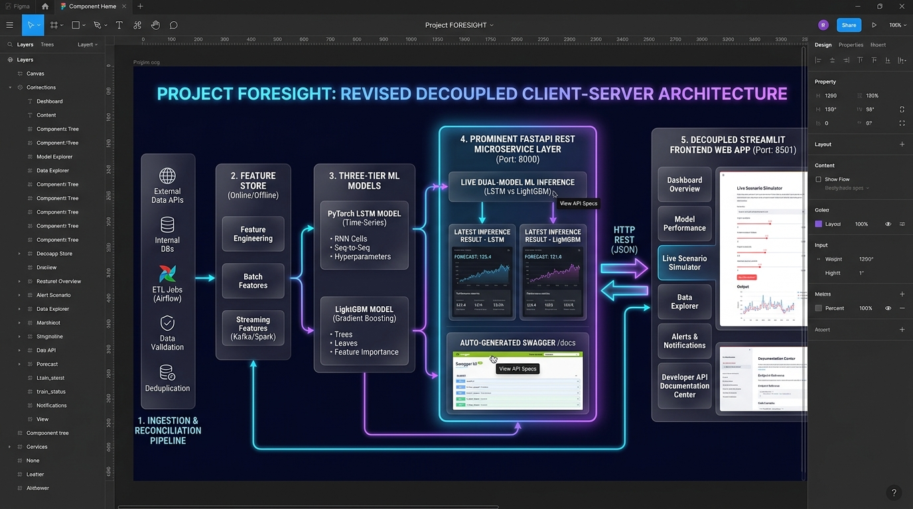
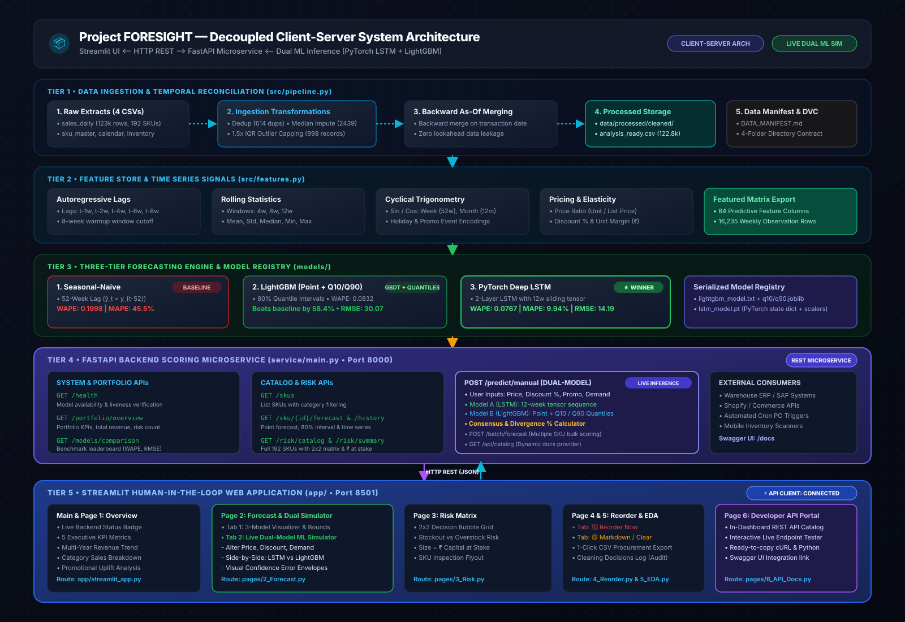

# Project FORESIGHT — Demand Forecasting & Inventory Intelligence

> **Client:** NorthBay Living (D2C Home & Lifestyle Brand) | **Platform:** Zidio Development

---

## 🏛️ System Architecture



- Access Figma design: 

```
┌─────────────────────────────────────────────────────────────────────────────────┐
│                       TIER 1: Ingestion & Reconciliation                         │
│  Raw Data (Sales, Catalog, Calendar, Inv) ──► Imputation, IQR Capping, As-Of Join│
└────────────────────────────────────────┬────────────────────────────────────────┘
                                         ▼
┌─────────────────────────────────────────────────────────────────────────────────┐
│                       TIER 2: Feature Store & Signals                           │
│  Lags (t-1..t-8) ──► Rolling Stats (4,8,12w) ──► Trig Encodings ──► Elasticities │
└────────────────────────────────────────┬────────────────────────────────────────┘
                                         ▼
┌─────────────────────────────────────────────────────────────────────────────────┐
│                       TIER 3: Forecasting Engine Zoo                            │
│  Seasonal-Naive (0.1998)  │  LightGBM Point+Quantiles (0.0832)  │  LSTM (0.0767) │
└────────────────────────────────────────┬────────────────────────────────────────┘
                                         ▼
┌─────────────────────────────────────────────────────────────────────────────────┐
│                       TIER 4: Risk Matrix & Capital-at-Stake                    │
│  Stockout vs Overstock Risk Scores ──► 2x2 Quadrant Matrix ──► ₹ at Stake Calc  │
└────────────────────────────────────────┬────────────────────────────────────────┘
                                         ▼
┌─────────────────────────────────────────────────────────────────────────────────┐
│                       TIER 5: Serving & Presentation Layer                      │
│  Streamlit Multi-Page App (foresight/app)  │  FastAPI REST Microservice (service)│
└─────────────────────────────────────────────────────────────────────────────────┘
```

---

## 📌 Executive Summary & Problem Statement

NorthBay Living is an online direct-to-consumer brand selling ~200 active SKUs across Furnishings, Décor, Kitchen, Lighting, and Storage fulfilled from a single warehouse. Historically, inventory was managed via spreadsheets, leading to:
1. **Stockouts on High-Velocity SKUs:** Lost revenue, ad spend waste, and customer churn.
2. **Overstock on Slow-Moving SKUs:** Working capital trapped in unsold goods, storage fees, and margin-eroding emergency markdowns.

**Project FORESIGHT** provides an automated, leakage-free analytics engine and web interface that transforms daily sales and inventory logs into:
- Highly accurate weekly demand forecasts 6 weeks into the future.
- Objective stockout and overstock risk scoring across all 192 catalog SKUs.
- Actionable operational recommendations (Reorder Now, Markdown / Clear, Watch / Volatile, Healthy) with exact Rupee (₹) amounts at risk.
- Real-time dual-model scenario simulation comparing **PyTorch LSTM** and **LightGBM** under live price and promotion changes.

---

## 🏆 Model Leaderboard & Backtest Results

Evaluated using temporal rolling-origin cross-validation with zero future leakage:

| Model | Architecture | WAPE (Primary) | MAPE (%) | RMSE | Bias (Units) | vs Baseline | Status |
|---|---|---|---|---|---|---|---|
| **PyTorch LSTM** | Deep Learning (Recurrent Sequence) | **0.0738** | **8.30%** | **14.04** | -0.30 | **+63.0%** | 🥇 **WINNER** |
| **LightGBM** | GBDT (Point + Quantiles 10/90) | **0.0854** | **25.59%** | **30.98** | +10.92 | **+57.3%** | 🥈 Runner-Up |
| **Seasonal Naive** | Historical Same-Week Baseline | **0.1998** | **45.48%** | **48.71** | +17.11 | 0.0% (Ref) | 🥉 Baseline Bar |

---

## 🎯 4-Quadrant Inventory Risk Decisioning Matrix

| Quadrant | Stockout Risk | Overstock Risk | Action Recommendation | Priority |
|---|---|---|---|---|
| 🔴 **Reorder Now** | HIGH (≥50%) | LOW (<50%) | Issue replenishment purchase order immediately | Critical |
| 🟡 **Markdown / Clear** | LOW (<50%) | HIGH (≥50%) | Initiate promotional discount to release tied-up capital | High |
| 🟠 **Watch / Volatile** | HIGH (≥50%) | HIGH (≥50%) | Inspect demand volatility and lead-time variability | Medium |
| 🟢 **Healthy** | LOW (<50%) | LOW (<50%) | Balanced stock vs lead-time demand; maintain posture | Steady |

---

## 🚀 Quickstart & Running Locally

### 1. Run the Complete End-to-End Pipeline
```powershell
# On Windows:
.\foresight\run_all.bat

# On Linux / macOS:
bash foresight/run_all.sh
```

### 2. Launch the FastAPI Microservice
```powershell
cd foresight
uvicorn service.main:app --reload --port 8000
```
*API Swagger Documentation: `http://localhost:8000/docs`*

### 3. Launch the Streamlit Operations Dashboard
```powershell
cd foresight
streamlit run app/streamlit_app.py
```
*Web Dashboard: `http://localhost:8501`*

---

## ☁️ Deployment Architecture

* **Frontend:** Hosted on **Streamlit Community Cloud** ([`foresight/app/streamlit_app.py`](foresight/app/streamlit_app.py)).
* **Backend:** Hosted on **Render** as a Python/FastAPI Web Service ([`foresight/service/main.py`](foresight/service/main.py)).
* **Integration:** Connect Streamlit to FastAPI by adding `FORESIGHT_API_URL` to Streamlit Cloud Secrets.
